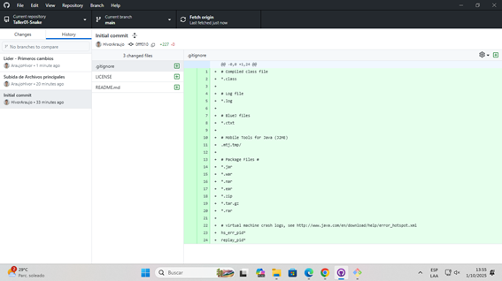

# Taller 01 - Snake 

## Integrantes
- *Líder:  Hivor Araujo → Cambios: texto botón "Start Game" a "Jugar", colores en SnakeModel.java y GoldModel.java.  
- *Integrante 1:* Ronald Machuca → Cambios: texto botón "Start Game" a "Let’s Go!!!", color cabeza de la serpiente.  
- *Integrante 2:* Franklin Rosado → Cambios: texto botón "Start Game" a "Let’s Play", color colector.  
- *Integrante 3:* Xavier Lopez → Cambios: texto botón "Start Game" a "Iniciar", color colector.  

## Trabajo en paralelo
Cada integrante realizó modificaciones locales según su rol y creó su *commit* correspondiente, pero sin realizar el push inmediato, para generar conflictos controlados.  

## ⚔️ Resolución de conflictos
El flujo fue el siguiente:  

1. *Líder:* hizo git push origin main sin conflictos.  
   - Captura: Push exitoso (Líder)
-   
2. *Integrante 1:* realizó su push → conflicto detectado.  
   - 📸 Captura: Error de conflicto en push
   - [Push inicial del Integrante|1](capturas/integrante11.jpeg)  
   - Usó git pull origin main para traer la versión remota.  
   - Resolución manual de conflictos (eliminando >>>>, ====, <<<<).  
   - Nuevo commit + push exitoso.  
   - 📸 Captura: Push corregido (Integrante 1)
   - [Push final del Integrante 1](capturas/integrante12.jpeg)    

3.*Integrante 2:* realizó su push → conflicto detectado.  
   - 📸 Captura: Error de conflicto en push
   - [Push inicial del Integrante|2](capturas/integrante21.jpeg)  
   - Usó git pull origin main para traer la versión remota.  
   - Resolución manual de conflictos (eliminando >>>>, ====, <<<<).  
   - Nuevo commit + push exitoso.  
   - 📸 Captura: Push corregido (Integrante 2)
   - [Push final del Integrante 2](capturas/integrante22.jpeg)  
*Integrante 3:* realizó su push → conflicto detectado.  
   - 📸 Captura: Error de conflicto en push
   - [Push inicial del Integrante|3](capturas/integrante31.jpeg)  
   - Usó git pull origin main para traer la versión remota.  
   - Resolución manual de conflictos (eliminando >>>>, ====, <<<<).  
   - Nuevo commit + push exitoso.  
   - 📸 Captura: Push corregido (Integrante 3)
   - [Push final del Integrante 3](capturas/integrante32.jpeg)  

## 🚀 Conclusiones
- Git permite trabajo colaborativo distribuido, pero es común que existan conflictos.  
- Resolver conflictos manualmente ayuda a comprender mejor la sincronización entre repositorios locales y remotos.  
- GitHub Desktop facilita la visualización, pero el entendimiento de los comandos es fundamental.
